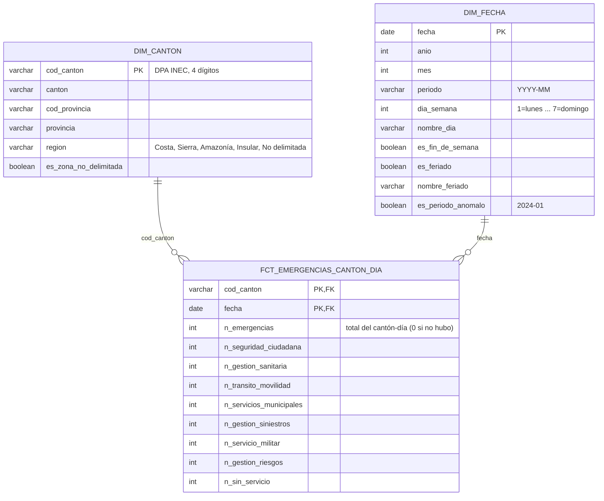

# Modelo dimensional (capa GOLD)

## Pregunta de negocio que debe responder
¿Cuántas emergencias tuvo **cada cantón en cada día**? Es lo que necesita el modelo de ML del PSet 1:
`y_h = 1` si las emergencias del cantón en t+h superan el P90 histórico de ese cantón y día de la semana.
El P90 **no** se calcula aquí: se calcula en la etapa de ML, solo con datos de entrenamiento, para evitar leakage.

## Grain de la tabla de hechos
**1 fila = 1 cantón en 1 día calendario**, incluidos los días sin emergencias (valor 0).

- Silver tiene 1 fila por incidente; Gold **agrega**: `COUNT(*)` por (cod_canton, fecha).
- Los días sin incidentes no existen en la fuente. Un *date spine* (todas las fechas × todos los cantones)
  los crea con 0. Sin esos ceros, el P90 y los promedios quedarían sesgados hacia arriba.
  En el histórico modelado, 26,716 cantón-días (6.32%) tienen cero emergencias.
- Solo cuentan las filas con `es_ubicacion_valida = true` (2,160 filas sin cantón no se pueden asignar).

## Diagrama



Versión texto:
```
                 ┌────────────────────┐
                 │     DIM_FECHA      │
                 │ PK fecha           │
                 │ anio, mes, periodo │
                 │ dia_semana, finde  │
                 │ es_feriado (seed)  │
                 │ es_periodo_anomalo │
                 └─────────┬──────────┘
                           │ 1
                           │
                           │ N
┌──────────────────┐   ┌───┴────────────────────────────┐
│    DIM_CANTON    │ 1 │  FCT_EMERGENCIAS_CANTON_DIA    │
│ PK cod_canton    ├───┤ PK (cod_canton, fecha)         │
│ canton           │ N │ n_emergencias                  │
│ provincia        │   │ n_<servicio> x 7, n_sin_servicio│
│ region           │   └────────────────────────────────┘
│ es_zona_no_delim.│
└──────────────────┘
```

## Decisiones de diseño

| Decisión | Alternativa descartada | Por qué |
|---|---|---|
| Grain cantón-día | incidente o cantón-mes | El target se define por cantón y día. El incidente ya está en Silver; un grain mensual perdería el día de la semana. |
| Date spine con ceros | solo los días con datos | Un día sin emergencias es un dato real (0), no un faltante. Los lags y el P90 lo necesitan. |
| Clave `cod_canton` (código DPA natural) | nombre del cantón o surrogate key | Existen cantones homónimos, como BOLÍVAR y OLMEDO, en provincias distintas. El código DPA identifica cada cantón. El modelo utiliza geografía vigente, sin versionado histórico de la dimensión (SCD). |
| Clave `fecha` (DATE) | `fecha_key` entero YYYYMMDD | Los joins en Spark son más simples y no hay que traducir claves. |
| Servicios como **columnas** del hecho (7 + sin servicio) | `dim_servicio` con grain cantón-día-servicio | Los 7 servicios son un conjunto fijo. El modelo de ML consume 1 fila por cantón-día, y otra dimensión multiplicaría el hecho ×8 (≈3.4 M filas) sin cambiar el target. |
| `es_periodo_anomalo` en `dim_fecha` | columna en el hecho | Es un atributo del mes, no del cantón. |
| Feriados nacionales como **seed** dbt (`feriados_ecuador.csv`) | API externa | Son pocas filas (~15 por año), cambian una vez al año y quedan versionadas en Git. Explican picos de demanda. |
| Región derivada de `cod_provincia` | seed de provincias | Son 25 códigos fijos: un `CASE` basta. |

### Cambio de límites: Sevilla Don Bosco
| Problema | Evidencia | Acción | Justificación |
|---|---|---|---|
| Cantón creado durante el periodo | La parroquia SEVILLA DON BOSCO figura en MORONA (1401, cód. 140157) desde 2021-07-01 hasta 2025-02-09 (11,019 filas, ~256/mes). Desde 2025-01-23 aparece como cantón 1413 (cód. 141350, 5,487 filas, ~274/mes). Es el único cantón que no aparece desde el inicio. | Silver reasigna las filas antiguas de esa parroquia al cantón 1413 mediante el seed `cantones_reasignados.csv` (**geografía vigente**). | Sin corrección, MORONA pierde ~12% de volumen en 2025, un quiebre artificial que alteraría su P90. Además, 1413 tendría ceros falsos antes de su creación o ningún histórico para ese periodo. La reasignación utiliza la parroquia registrada en la fuente; el volumen mensual similar antes y después respalda la continuidad de la serie. |

Con esto, **los 224 cantones tienen datos desde 2021-07-01** y el spine es un producto cartesiano completo.

## Conteos del histórico validado

Estos conteos corresponden a los meses de julio de 2021 a agosto de 2026.
| Tabla | Filas esperadas | Regla |
|---|---|---|
| `dim_canton` | 224 | 1 por `cod_canton` |
| `dim_fecha` | 2,191 | 2021-01-01 → 2026-12-31 (años completos, sirve también para predecir) |
| `fct_emergencias_canton_dia` | **422,912** | 224 cantones × 1,888 días (2021-07-01 → 2026-08-31) |
| `SUM(n_emergencias)` | **17,678,093** | = filas de Silver con `es_ubicacion_valida` (17,680,253 − 2,160) |
| cantón-días con 0 | ≈ 27–28 mil (~6.5%) — **real: 26,716 (6.32%)** | 422,912 − cantón-días con datos |

Los tests implementados validan `unique` + `not_null` en las PK de las dimensiones;
unicidad de (cod_canton, fecha) en el hecho; `relationships` del hecho hacia ambas dimensiones;
filas del hecho = cantones × días; suma del hecho = Silver válidas; suma de los servicios = `n_emergencias`.

## Variables construidas fuera de Gold

- **Target `y_h` y P90**: se calculan en ML, con el corte train/test (evita leakage).
- **Lags y medias móviles** (features): se construyen en la OBT con Spark, a partir de este hecho.
  Usan solo días anteriores a t (`lag_1d/7d/14d/28d`, `media_prev_7d/28d`).
- **Población por cantón (INEC)**: sería útil para calcular tasas, pero no se incluye. Queda como limitación y mejora futura.
